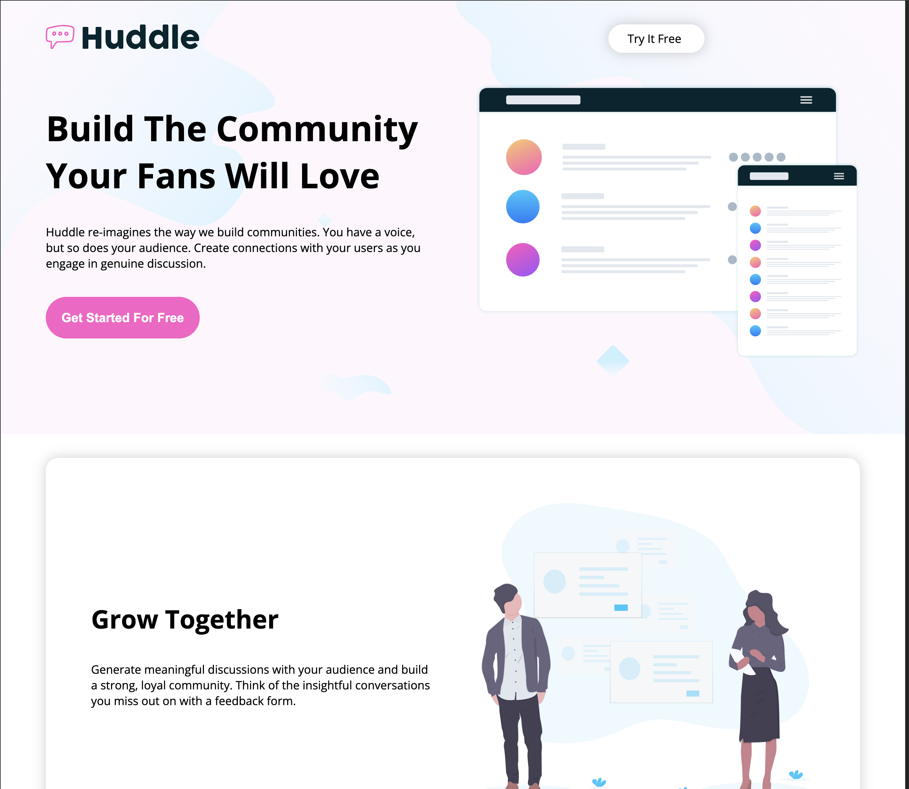

Huddle Landing Page
Ce projet consiste à réaliser une page d’atterrissage (landing page) pour la plateforme fictive Huddle. L’objectif est de mettre en pratique les compétences en HTML et CSS acquises, en créant une page web moderne, responsive et attrayante.

Structurer le contenu avec des balises HTML sémantiques.
Mettre en forme la page grâce au CSS : couleurs, typographies, espacements, boutons, etc.
Intégrer des images, des icônes et des logos.
Rendre la page responsive pour une expérience optimale sur tous les appareils.
Créer une navigation claire et un pied de page complet avec des liens et des réseaux sociaux.
Ce projet permet de consolider les bases du développement web front-end et de se familiariser avec la création d’interfaces utilisateur professionnelles.

Objectifs

 ["Apprendre à structurer une page web","Apprendre à utiliser les images et les icônes","Apprendre à mettre en forme avec CSS & utiliser les polices externes","Apprendre à Structurer le contenu"]

 ** Lien menant à la page :
 https://epiphane-code.github.io/Hundle/

 ** Voir l'apperçu de la page
 